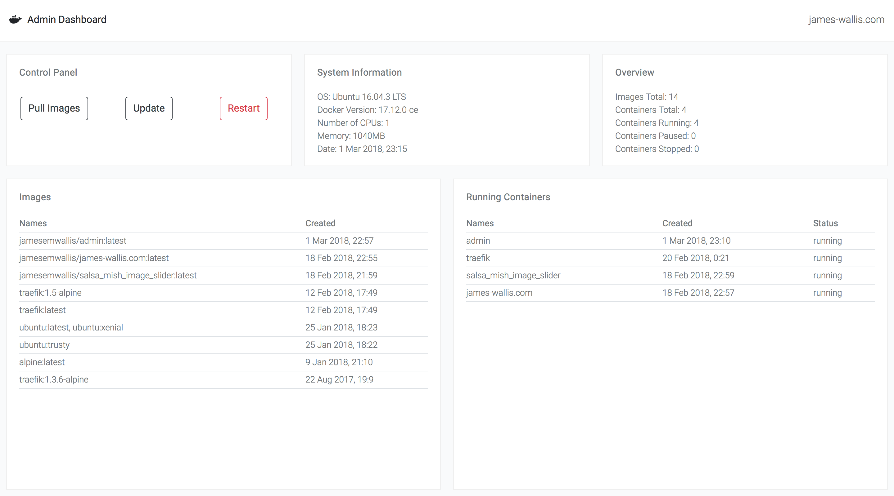

# admin
The admin dashboard for james-wallis.com

## Purpose
To provide an easy way to monitor and configure my Digital Ocean server which runs uses [Docker](https://www.docker.com/) and [Traefik](https://traefik.io/) to run my website and other applications.

## Features
- [x] Display all Docker containers, when they were created and their current status (running, stopped, exited).
- [x] Display all Docker images and when they were created.
- [x] Show an overview of all containers and images on the server.
- [x] System information about the server (OS, Docker version, no. CPUs, memory and date/time)
- [ ] Update Docker images and containers (Using docker-compose commands).
    * This means I'll never need to SSH into the server to update Docker containers/images.
- [ ] Modify master docker-compose file which controls the server containers.
    * This will allow me to update the docker-compose file on the fly and add new services/containers to my server.

## Screenshot

